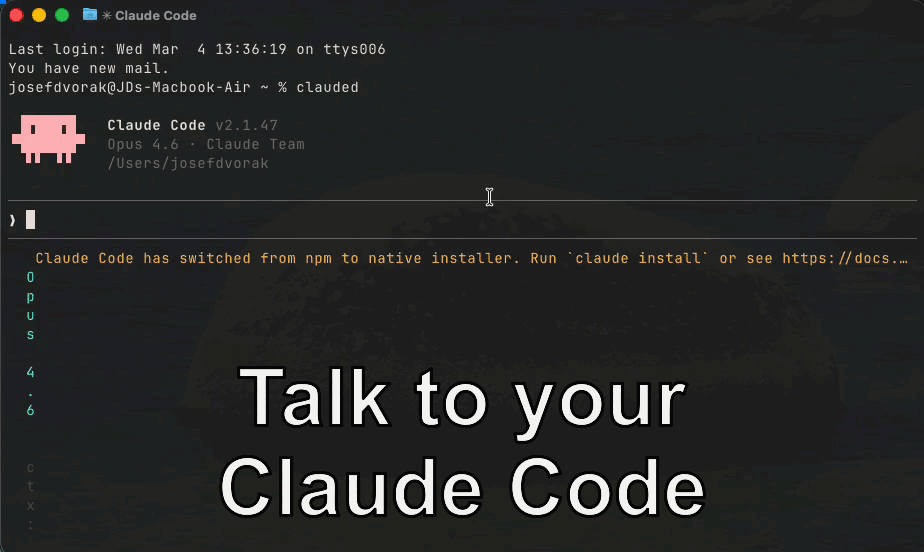

# claude-code-dictate

<p align="center">
  
</p>

Voice dictation for [Claude Code](https://docs.anthropic.com/en/docs/claude-code). Speak instead of typing — everything is transcribed locally on your Mac using [Whisper](https://github.com/ml-explore/mlx-examples/tree/main/whisper) on Apple Silicon. No API calls, no cloud, fully on-device.

## Requirements

- macOS on Apple Silicon (M1/M2/M3/M4)
- Python 3.10+
- [Homebrew](https://brew.sh) (for PortAudio, installed automatically)
- Microphone access

## Install

```bash
git clone https://github.com/DvorakJosef/claude-code-dictate.git
cd claude-code-dictate
./install.sh
```

The installer will:
1. Check prerequisites (Python 3.10+, PortAudio — auto-installs via Homebrew if missing)
2. Create a Python venv at `~/.local/share/dictate/` with `mlx-whisper`, `sounddevice`, and `numpy`
3. Install `dictate` and `dictate-editor` CLI wrappers to `~/.local/bin/`
4. Install `/dictate` and `/stop-dictate` slash commands to `~/.claude/commands/`

Make sure `~/.local/bin` is in your `PATH`. If not, add to `~/.zshrc`:
```bash
export PATH="$HOME/.local/bin:$PATH"
```

## Usage

There are three ways to use dictation with Claude Code:

### 1. Ctrl+G — voice input into the input field (recommended)

This lets you dictate directly into Claude Code's input field, edit the text, and send it when ready.

Add this alias to your `~/.zshrc` (or `~/.bashrc`):

```bash
alias claude='EDITOR=dictate-editor claude'
```

Then in any Claude Code session:
1. Press **Ctrl+G**
2. You hear **"recording started"** — speak your message
3. After you stop speaking, recording auto-stops (VAD)
4. You hear **"recording ended"** — transcription appears in the input field
5. Edit if needed, then press **Enter** to send

This uses Claude Code's built-in external editor feature (`Ctrl+G`) with a voice-recording "editor" instead of a text editor.

### 2. /dictate — slash command

Type `/dictate` in Claude Code to start recording. After transcription, you'll see the text and a menu:

- **Use as input** — Claude treats the transcription as your message and responds
- **Modify** — edit the transcription before sending
- **Something else** — provide custom instructions

The menu language automatically adapts to the language of your speech.

Use `/stop-dictate` to manually stop a recording before VAD triggers.

### 3. Standalone CLI

Use `dictate` directly in your terminal outside of Claude Code:

```bash
# Record until you press Enter
dictate

# Auto-stop after silence (voice activity detection)
dictate --vad

# Use a specific model
dictate --model small    # tiny | small | turbo (default) | large-v3

# Force a language instead of auto-detect
dictate --language cs

# Fixed duration recording
dictate --duration 10

# Adjust silence timeout for VAD (default: 2s)
dictate --vad --silence-timeout 5
```

When run in a terminal, the CLI shows a live progress bar with recording status:
```
⬤ 0:05 ━━━━━━░░░░░░░░░░░░░░  speech
```

When stdout is a TTY, the transcription is also copied to the clipboard.

## How it works

1. **Recording** — audio is captured from the default microphone via PortAudio at 16kHz mono
2. **Voice Activity Detection (VAD)** — a 0.5s calibration phase measures ambient noise, then the threshold is set to 3x ambient RMS. Recording auto-stops after silence exceeds the timeout (default 2s)
3. **Audio announcements** — in VAD mode, macOS `say` announces "recording started" (before the mic opens) and "recording ended" (after the mic closes) so you know when to speak
4. **Transcription** — the recorded audio is transcribed locally using [mlx-whisper](https://github.com/ml-explore/mlx-examples/tree/main/whisper), an Apple Silicon-optimized Whisper implementation. Language is auto-detected
5. **Output** — transcription goes to stdout (or into the Claude Code input field when used via Ctrl+G / slash command)

## Models

| Name       | HuggingFace repo                         | Speed   | Quality |
|------------|------------------------------------------|---------|---------|
| `tiny`     | `mlx-community/whisper-tiny`             | Fastest | Basic   |
| `small`    | `mlx-community/whisper-small-mlx`        | Fast    | Good    |
| `turbo`    | `mlx-community/whisper-large-v3-turbo`   | Medium  | Great   |
| `large-v3` | `mlx-community/whisper-large-v3-mlx`    | Slow    | Best    |

The default is `turbo` — a good balance of speed and accuracy. Models are downloaded automatically from HuggingFace on first use (~1.5 GB for turbo).

## Uninstall

```bash
rm -rf ~/.local/share/dictate
rm ~/.local/bin/dictate ~/.local/bin/dictate-editor
rm ~/.claude/commands/dictate.md ~/.claude/commands/stop-dictate.md
```

Remove the `alias claude=...` line from `~/.zshrc` if you added it.

## License

MIT
